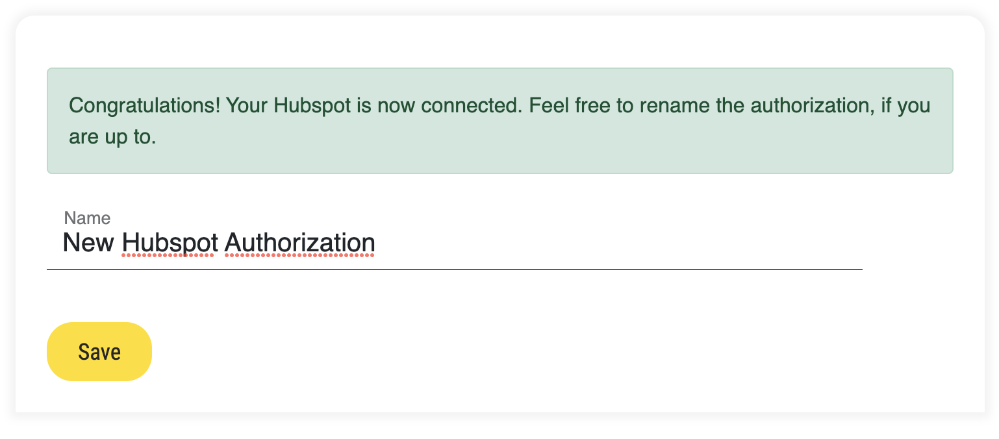
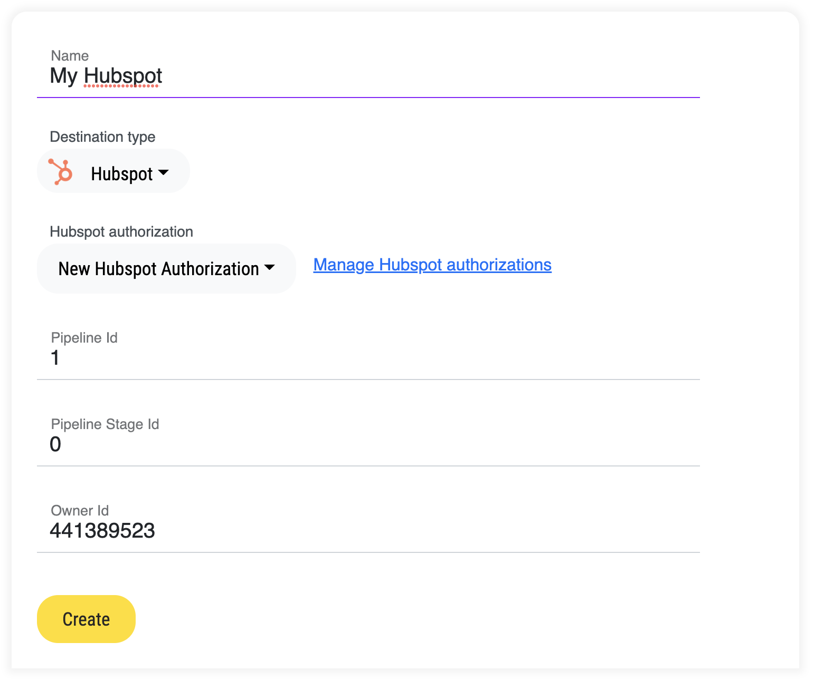

# Connecting a Hubspot

HubSpot is a software platform designed to help your company market and sell more effectively (CRM, ROI and stuff like this).

### How to connect?

As in every case, you'd need to go to the list of your destinations, click "Add destination" and select Hubspot.
\
\
Most likely you don't have any authorization yet, so you will see something like this.  

<figure><figcaption></figcaption></figure>

So first things first — the authorization.

### Authorize your Hubspot

Go to "[Hubspot Authorizations](https://app.datamin.io/hubspot-authorizations)" and click "Add Hubspot Authorization". 
You will be redirected to the something like this.

<figure><figcaption></figcaption></figure>

Once consent's given, you will be redirected back to our application, where you could change the name 
of just freshly connected Hubpost of yours.

<figure><figcaption></figcaption></figure>

### Configure your new destination

Now, on the page of new Hubspot destination creation yuo can choose your just connected Hubspot. Now the question is, what are those pipeline id, pipeline stage id and owner id? 
tdlr: these are the internal ids in your Hubspot. How to find them?

#### Pipeline / stage id

First of all navigate yourself to the pipelines configuration, by clicking that link on the Tickets page.

<figure><figcaption></figcaption></figure>

In there you will find a list of your pipelines and corresponding stages. By clicking </>, it will reveal an id which you
will need to put it in your destination configuration.

#### Owner id

Owner is who creates a ticket. E.g, you could create a special account for just Datamin
or use any other natural person account. In order to find the owner id, please go to the 
ticket properties, find a property "Ticket Owner", click "Edit".
\
\
You'll see something like this.
<figure><figcaption></figcaption></figure>

You need to copy a value in the red rectangle. 

### Example of the configured destination

After you've done all steps above, your Hubspot configuration in Datamin's gonna look like this way. 
Now you can use it in your workflows!

<figure><figcaption></figcaption></figure>
