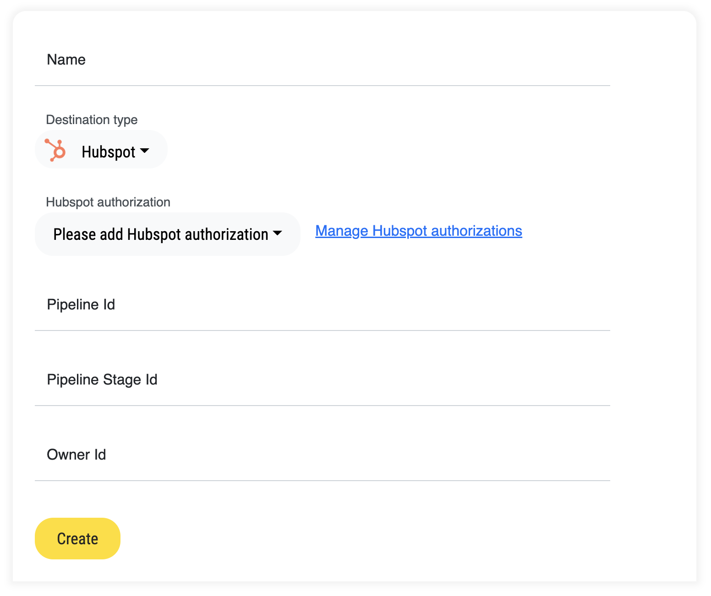
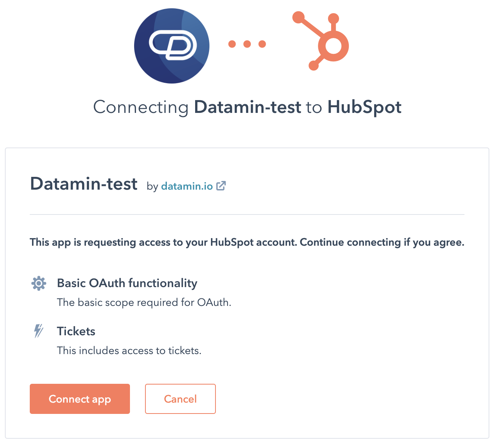
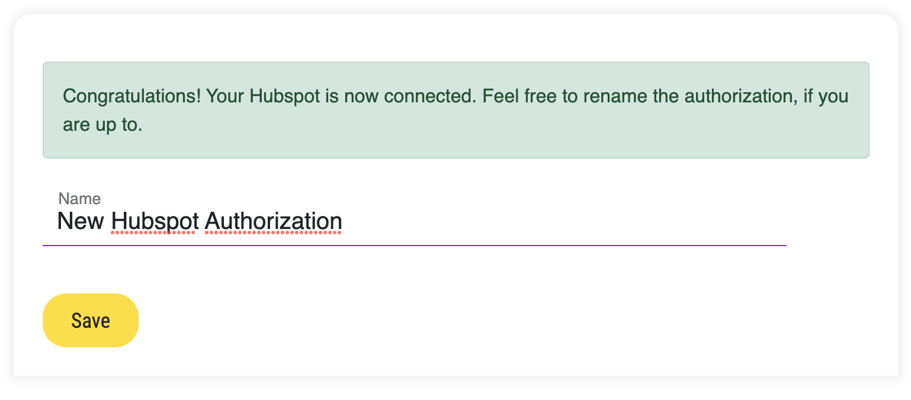
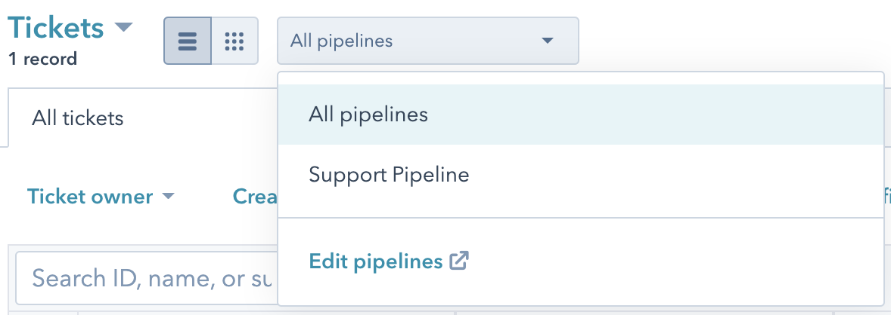
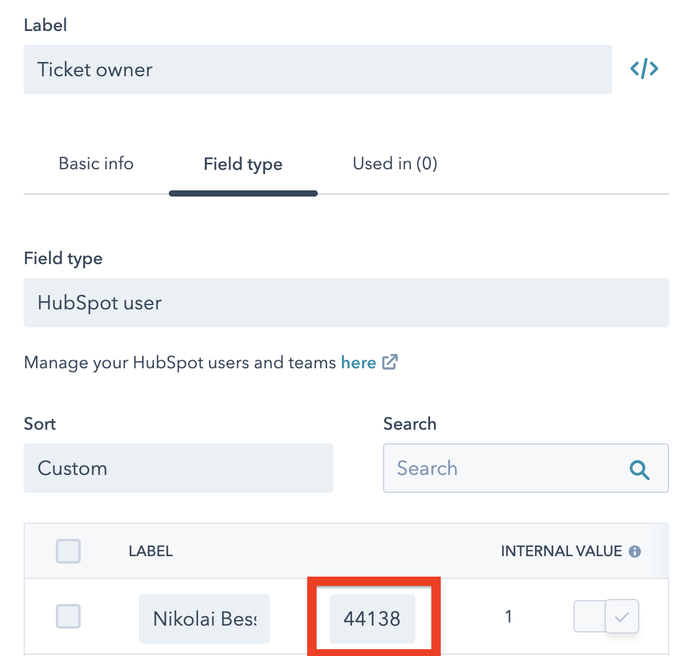
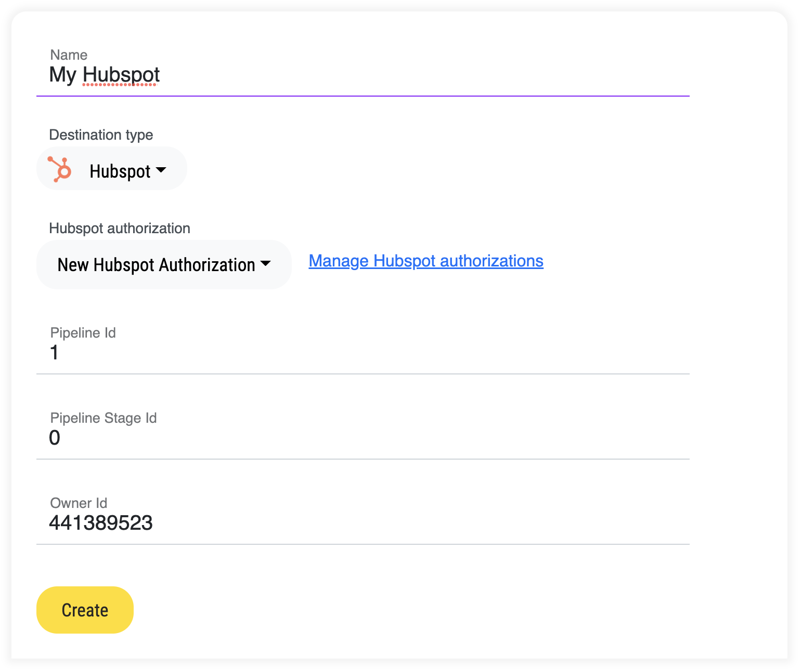

# Hubspot


Open-source and On-premise editions of Ylem require separate specific configurations for this integration. See [below](hubspot.md#configuring-integration-for-open-source-and-on-premise-versions)


**Integration type**: `Write`

Integration with Hubspot allows you to create tickets there in a real-time streaming mode.\
\
Instructions are available in the video or the text below.


How to integrate Ylem with Hubspot


## How to connect?

<figure><figcaption></figcaption></figure>

So first things first — the authorization.

## Authorize your Hubspot

Go to "[Hubspot Authorizations](https://app.datamin.io/hubspot-authorizations)" and click "Add Hubspot Authorization". You will be redirected to Hubspot's page where you need to give your concern.

<figure><figcaption></figcaption></figure>

Once consent's given, you will be redirected back to our application, where you can change the name of just a freshly connected Hubspot instance of yours.

<figure><figcaption></figcaption></figure>

## Configure your new destination

Now, on the page of new Hubspot destination creation, you can choose your just-connected Hubspot. Now the question is, what are those pipeline IDs, pipeline stage ID, and owner ID? These are the internal IDs in your Hubspot. How to find them?

#### Pipeline / stage id

First of all navigate yourself to the configuration of pipelines, by clicking that link on the Tickets page.

<figure><figcaption></figcaption></figure>

In there you will find a list of your pipelines and corresponding stages. By clicking \</>, it will reveal an ID, that you will need to put in your destination configuration.

#### Owner id

An owner is the one who creates a ticket. E.g, you could create a special account for just Ylem or use any other natural person account. In order to find the owner id, please go to the ticket properties, find a property "Ticket Owner", and click "Edit".\
\
You'll see something like this.

<figure><figcaption></figcaption></figure>

You need to copy a value in the red rectangle.

### Example of the configured destination

After you've done all the steps above, your Hubspot configuration in Ylem will look like this. Now you can use it in your pipelines!

<figure><figcaption></figcaption></figure>

## Configuring integration for open-source and on-premise versions

If you don't use the cloud version of Ylem but have it installed on your infrastructure under your domain name, you can choose one of the following two ways how to make this integration work.

### Using Hubspot and OAuth 2.0

It is the same way how it works in our cloud version. You need to create your own Hubspot Application and integrate your Ylem instance with it so that your users will be able to authorize Ylem to access their Atlassian accounts.

Here you can read more about how to manage [OAuth 2.0 authentication with Hubspot](https://developers.hubspot.com/docs/api/oauth-quickstart-guide).

As soon as the application is created, you will get OAuth 2.0 `CLIENT_ID` and `CLIENT_SECRET` that must be placed into the `./backend/integrations/.env` file of Ylem together with the redirect URL to your Ylem instance:

```
INTEGRATIONS_HUBSPOT_OAUTH_CLIENT_ID=%%REPLACE_IT_WITH_THE_CLIENT_ID_OF_YOUR_APP%%
INTEGRATIONS_HUBSPOT_OAUTH_CLIENT_SECRET=%%REPLACE_IT_WITH_THE_CLIENT_SECRET_OF_YOUR_APP%%
INTEGRATIONS_HUBSPOT_AFTER_AUTHORIZATION_REDIRECT_URL=https://%%REPLACE_IT_WITH_THE_DOMAIN_NAME_OF_YOUR_YLEM_INSTANCE%%/hubspot-authorizations/{uuid}/?justConnected
```

Now you can open **https://%%YOUR\_YLEM\_DOMAIN\_NAME%%/hubspot-authorizations** and try to authorize Hubspot Integration by clicking on the button "**Add Hubspot authorization**".&#x20;

If configured correctly, the process from this point should work exactly as same as [described above](hubspot.md#authorize-your-hubspot).

### Using API integration, Hubspot API, and Private app access tokens

Another way of creating an integration with Hubspot to be able to create tickets directly from Ylem is using its REST API with Private app access tokens.

#### Step 1. Create your Private app access token

Private app access tokens is a safe alternative to using username and password for authentication with various 3rd-party services like Ylem.

This page contains a detailed explanation of how it can be created:



#### Step 2. Creating API Integration and sending requests to it from Ylem pipelines

As soon as you have your Private app access token configured, you can use it as an Access Token for POST/GET requests to Hubspot API.

Check [Hubspot REST API reference](https://developers.hubspot.com/docs/api/private-apps) and create a Ylem [API Integration](apis.md) with it:

<figure><figcaption></figcaption></figure>

Now you can call it directly from the Ylem pipelines with the necessary query parameters and headers using the [API\_Call](../../pipelines/tasks-ip/api-call.md) task.

<figure><figcaption></figcaption></figure>
