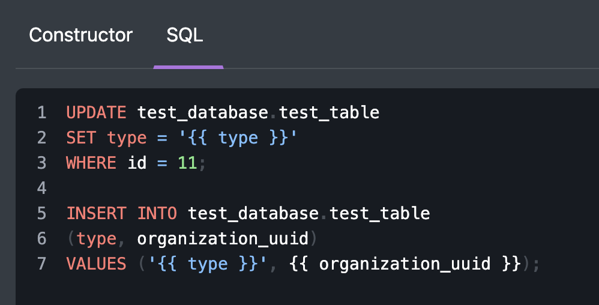

# Query

The "**Query"** is a task that can retrieve data from [SQL-based integrations](broken-reference) and write to it.

For retrieving the data you can either write an SQL query you want or use a constructor of queries if the desired query is simple enough:

How to **SELECT** data with a UI-constructor:

<figure><figcaption></figcaption></figure>

How to do the same with SQL query:

<figure><figcaption></figcaption></figure>

How to **UPDATE** or **INSERT** a dataset into a database:

<figure><figcaption></figcaption></figure>
