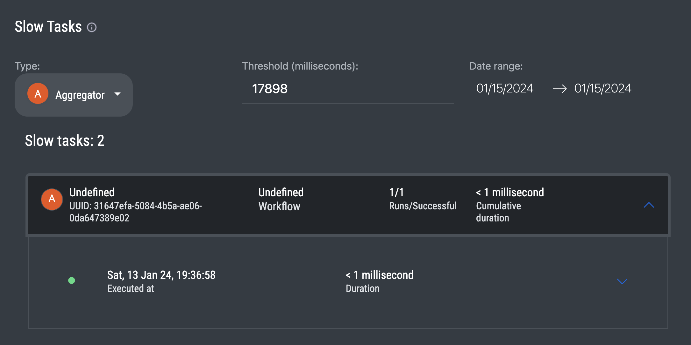

# Slow tasks

Sometimes pipelines become slow. And there are multiple reasons for this that in 95% of cases are external to Ylem:

* Slow processing of information on the database side
* Slow response from external networks
* Lack of resources to process pipelines that conflict with each other

The last point is especially important if you have too many slow pipelines they start conflicting and waiting for available cluster resources to process them. It causes delays and slows down the performance.

Therefore we introduced a [slow task profiling tool](https://app.datamin.io/slow-tasks).

<figure><figcaption>
Example of how to profile slow Aggregators within a certain data range
</figcaption></figure>

With this tool, you will always be aware of slow tasks and queries, failed workflow runs, and incorrect inputs/outputs.&#x20;

You can play with a [type of the task](../pipelines/tasks-ip/), a data range, and a processing threshold in milliseconds. As a result, it will show you what tasks of what pipelines took more time to process than milliseconds when it was executed, and what output it returned. Having this information you can look deeper into your infrastructure and improve the performance of your pipelines.
